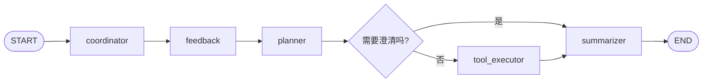
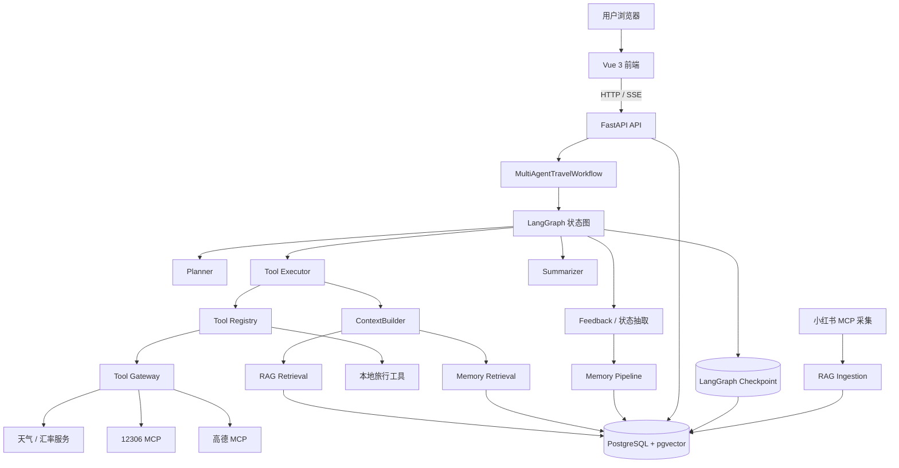
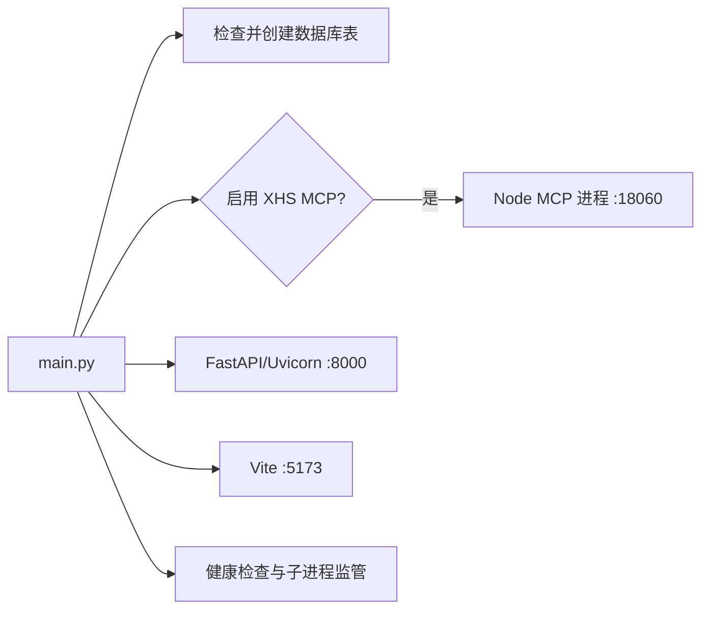
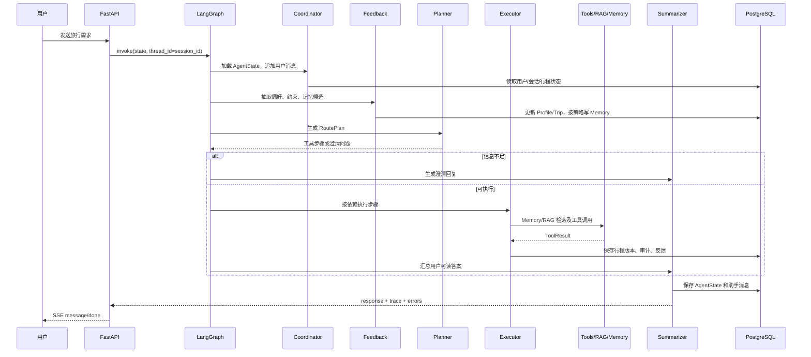
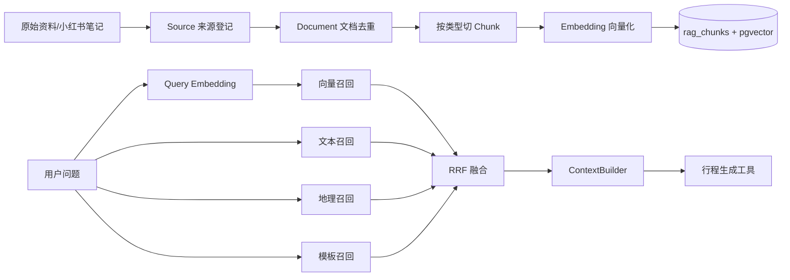
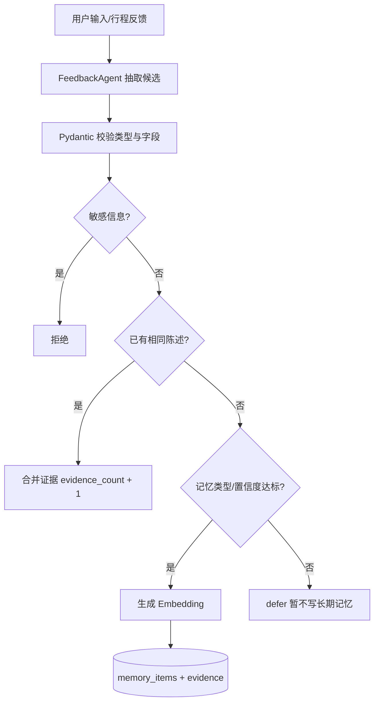

# TravelMind 项目源码学习报告

> 面向目标：通过一个可运行的旅行规划项目，理解 LangGraph、LangChain 生态、RAG、Memory 管理与 Context 管理。
>
> 阅读原则：先建立全局心智模型，再沿一次真实请求追踪源码，最后通过实验修改代码。本文以当前仓库源码为准；“已实现”和“建议演进”会明确区分。

---

## 快速导航

- 基础认知：[五个关键问题](#0-先回答五个最关键的问题) · [系统全景图](#1-系统全景图) · [项目目录](#2-项目目录与职责)
- 主链路：[启动过程](#3-启动过程从-mainpy-看完整应用) · [请求生命周期](#4-一次对话请求的完整生命周期) · [LangGraph](#5-langgraph-深入理解)
- 核心能力：[LangChain 概念映射](#6-从本项目理解-langchain-生态) · [工具与 MCP](#7-工具系统与-mcp) · [RAG](#8-rag从文档到回答上下文) · [Memory](#9-memory-管理系统如何记住用户) · [Context](#10-context-管理有限-prompt-中放什么)
- 工程实践：[数据库](#11-数据库与持久化模型) · [前端与 API](#12-前端与-api-如何协作) · [评测](#13-评测体系) · [实现边界](#15-当前实现边界与可演进方向)
- 学习执行：[源码阅读顺序](#16-推荐的源码阅读顺序) · [四周路线](#17-四周实践学习路线) · [源码实验](#18-建议完成的六个源码实验) · [调试路径](#19-常见调试路径)

关键源码入口：

- [统一启动入口](../main.py)
- [LangGraph 图定义](../multi_agent/graph.py)
- [图状态](../multi_agent/state.py)
- [工作流节点](../multi_agent/nodes.py)
- [规划器](../multi_agent/planner.py)
- [工具执行器](../multi_agent/executor.py)
- [上下文构建器](../services/context_builder.py)
- [RAG 检索](../services/rag_retrieval.py)
- [Memory Pipeline](../services/memory_pipeline.py)
- [数据库模型](../db/models.py)
- [会话 API](../api/sessions.py)
- [聊天前端](../frontend/src/views/ChatView.vue)
- [评测说明](../evaluation/README.md)

---

## 0. 先回答五个最关键的问题

### 0.1 这个项目本质上是什么？

TravelMind 是一个有状态的旅行规划 Agent 应用。用户不是只问一次、得到一次答案，而是可以在同一会话里逐步补充目的地、天数、预算和偏好，并对已有行程继续修改。

它的核心不是“调用一次大模型”，而是下面这条流水线：

```text
用户输入
  → 识别并更新状态
  → 规划本次需要执行的工具
  → 按依赖关系执行工具
  → 检索知识库和用户记忆
  → 生成或修改结构化行程
  → 汇总为用户可读答案
  → 保存会话、行程版本和记忆
```

### 0.2 LangGraph 在哪里？

LangGraph 位于 `multi_agent/graph.py`，负责把多个节点组织成一个有状态图。当前主图是：



LangGraph 管的是“流程如何流转”；旅行偏好、行程、工具结果等业务数据则由项目自己的 Pydantic Schema、数据库和服务层管理。

### 0.3 LangChain 在哪里？

当前代码没有直接导入 `langchain`，`requirements.txt` 也没有声明 LangChain。项目直接使用：

- LangGraph：状态图和 checkpoint；
- OpenAI 兼容 SDK：调用 DeepSeek 和 DashScope；
- 自定义 `BaseTool`、`ToolRegistry`、Prompt 和 JSON 解析逻辑。

因此，学习本项目时应把“LangChain”理解为一组 Agent 工程概念，而不是误认为项目使用了 LangChain 的每个类。概念映射如下：

| LangChain 常见概念 | TravelMind 当前实现 |
|---|---|
| Chat Model | `services/llm_service.py` 中的 OpenAI 兼容客户端 |
| Embedding Model | `services/embedding_service.py` |
| Prompt Template | Planner、工具中的字符串 Prompt |
| Output Parser | JSON 提取、Pydantic 校验 |
| Tool | `tools/base.py` 及各具体 Tool |
| Tool Registry | `tools/registry.py` |
| Agent Executor | `multi_agent/planner.py` + `multi_agent/executor.py` |
| Runnable/Chain | 主要由普通 Python 服务调用和 LangGraph 节点替代 |
| Memory | 项目自建的会话状态、长期记忆和 checkpoint |

### 0.4 RAG 和 Memory 有什么不同？

- RAG 回答“外部知识中有什么”：攻略、地点资料、小红书笔记、公共或用户私有文档。
- Memory 回答“这个用户过去表现出什么偏好或经历”：喜欢自然、讨厌过度商业化、上次接受了怎样的行程等。
- Context 回答“这一次调用模型时，有限的 Prompt 空间里应该放什么”。
- Checkpoint 回答“LangGraph 这条执行线程运行到哪里、状态是什么”。

四者有关联，但绝不是同一件事。

### 0.5 一次请求的主入口在哪里？

Web 请求的主路径是：

```text
frontend/src/views/ChatView.vue
  → frontend/src/services/api.ts
  → POST /api/v1/sessions/{session_id}/messages/stream
  → api/sessions.py
  → multi_agent/workflow.py
  → multi_agent/graph.py
  → coordinator / feedback / planner / tool_executor / summarizer
```

建议把这条路径完整跟读一遍，它是理解整个项目最快的路线。

---

## 1. 系统全景图



系统可以分成六层：

1. 表现层：Vue 页面、地图、会话、行程卡片。
2. 接口层：FastAPI 路由、鉴权上下文、SSE、异常处理。
3. 编排层：LangGraph 和多节点工作流。
4. 能力层：大模型、工具、MCP、RAG、Memory、Context。
5. 数据层：Repository、SQLAlchemy、PostgreSQL、pgvector。
6. 质量层：测试、日志、工具审计、离线评测。

---

## 2. 项目目录与职责

| 路径 | 主要职责 | 建议重点 |
|---|---|---|
| `main.py` | 一键启动后端、前端及可选小红书 MCP；管理子进程 | 了解本地多进程应用如何启动和退出 |
| `config/` | 环境配置与小红书试点配置 | Pydantic Settings、`.env`、配置边界 |
| `api/` | FastAPI 路由、中间件和依赖注入 | HTTP API、SSE、用户隔离、错误处理 |
| `multi_agent/` | Agent 状态图、节点、规划器、执行器、总结器 | LangGraph 的核心学习区 |
| `tools/` | 本地工具、MCP 工具包装、输入输出 Schema、注册表 | Tool Calling 和统一接口设计 |
| `services/` | RAG、Memory、Context、MCP、LLM、Embedding、个性化等领域服务 | 核心业务能力 |
| `schemas/` | Pydantic 数据模型 | 结构化状态、数据契约、校验 |
| `repositories/` | 数据访问封装 | Repository 模式、用户数据隔离 |
| `db/` | SQLAlchemy 模型、引擎、Alembic 迁移 | 关系模型、pgvector、事务 |
| `memory/` | 兼容旧 JSON 存储的 MemoryManager | 迁移期的 source of truth 设计 |
| `frontend/` | Vue 3 + TypeScript + Pinia 前端 | 状态管理、SSE 消费、组件化 UI |
| `scripts/` | 启动、数据库、RAG、小红书、评测管理脚本 | 运维入口和批处理入口 |
| `evaluation/` | 金银集、检索/行程/记忆指标和报告 | RAG 与 Agent 评测 |
| `tests/` | 单元、集成、端到端测试 | 从测试反向理解设计契约 |
| `rag_data/` | RAG 原始文本归档 | 原文可追踪性，不等于向量库本身 |
| `outputs/` | 导出行程、评测报告等运行产物 | 不应当作源代码 |

### 2.1 为什么要按层拆分？

例如“检索知识库”不应直接写在 API 路由里：

- API 只负责接收和返回数据；
- Service 负责检索逻辑；
- Repository 负责数据库读写；
- Schema 负责输入输出是否合法；
- Evaluation 负责判断检索好不好。

这种分层使某一部分可以单独测试和替换。例如未来替换 Embedding 模型，不需要重写 API 和前端。

---

## 3. 启动过程：从 `main.py` 看完整应用

默认运行 `main.py` 时，程序会组织以下进程：



关键知识：

- `main.py` 是开发期进程管理器，不是 Agent 本身。
- `python main.py --cli` 进入命令行交互模式。
- Web 模式下后端与前端是两个独立进程。
- PostgreSQL 通常是另一个系统服务或容器，并非 Python 子进程。
- 子进程异常退出时，主程序负责发现并结束其余进程。

学习练习：先读 `main.py`，列出它启动每个进程的命令、端口、健康检查 URL 和退出条件。

---

## 4. 一次对话请求的完整生命周期

### 4.1 前端发起请求

`ChatView.vue` 先把用户消息和一个 pending 助手消息放进 Pinia 状态，然后调用 `streamMessage()`。

`frontend/src/services/api.ts` 使用 `fetch()` 请求：

```text
POST /api/v1/sessions/{session_id}/messages/stream
X-User-ID: demo_traveler
Content-Type: application/json
```

### 4.2 API 建立 SSE 响应

`api/sessions.py`：

1. 检查 session 是否属于当前用户；
2. 先发送 `status` 事件；
3. 在线程中执行同步工作流，避免阻塞异步事件循环；
4. 工作流结束后发送 `message`；
5. 最后发送 `done`，异常时发送 `error`。

当前 SSE 是“过程状态 + 完整最终消息”，不是 LLM token 逐字流式输出。这是阅读前端时很容易混淆的一点。

### 4.3 工作流进入 LangGraph

`MultiAgentTravelWorkflow.run_with_state()` 构造初始 `TravelGraphState`，再调用：

```python
graph.invoke(
    input_state,
    config={"configurable": {"thread_id": session_id}},
)
```

这里的 `thread_id` 是 LangGraph checkpoint 的线程标识。项目直接使用 `session_id`，使一段会话与一条图执行线程自然对应。

### 4.4 节点逐步处理



---

## 5. LangGraph 深入理解

### 5.1 State：图中流动的数据

`multi_agent/state.py` 定义 `TravelGraphState`。它是 LangGraph 节点之间传递的“工作信封”，包含：

- 用户、会话、请求 ID；
- 本轮用户输入；
- 序列化后的业务 `AgentState`；
- Planner 生成的 `route_plan`；
- 工具结果；
- 最终回复；
- 是否需要澄清和澄清问题；
- 当前节点、节点轨迹、错误列表；
- 执行耗时。

不要把它和 `schemas/agent_state.py` 中的 `AgentState` 混为一谈：

| 对象 | 生命周期 | 用途 |
|---|---|---|
| `TravelGraphState` | 一次图调用及其 checkpoint | 节点间编排、追踪本轮执行 |
| `AgentState` | 跨轮会话与当前旅行 | 用户画像、当前需求、行程、聊天历史 |
| `UserProfile` | 跨会话、跨旅行 | 稳定偏好 |
| `TravelRequest` | 当前旅行 | 目的地、日期、天数、预算等约束 |

这种“双层状态”设计很重要：编排状态服务于工作流，业务状态服务于产品。

### 5.2 Node：把复杂任务拆成确定职责

当前节点角色：

| 节点 | 核心职责 | 不应负责 |
|---|---|---|
| Coordinator | 加载状态、追加用户消息、准备本轮上下文 | 决定调用哪些外部工具 |
| Feedback | 抽取需求、偏好和记忆候选；更新状态 | 直接生成最终行程 |
| Planner | 把目标变成带依赖的工具步骤 | 实际调用工具 |
| Tool Executor | 执行工具、检索 Memory/RAG、合并结果 | 决定用户最终看到的文字格式 |
| Summarizer | 把结构化结果转成用户可读内容 | 暴露内部 ID 和原始 JSON |

拆分节点的价值在于：每个节点都可以有独立输入输出、日志、测试和失败策略。

### 5.3 Edge：为什么要有条件分支？

Planner 不一定总能直接执行。例如用户只说“帮我规划旅行”，缺少目的地。当前逻辑会在置信度过低，或者修改行程但没有现有行程时设置澄清状态。

条件边判断：

```text
needs_clarification = true  → summarizer → 用户补充信息
needs_clarification = false → tool_executor → summarizer
```

这是 Agent 与固定流水线的差异之一：路径可以根据状态动态变化。

### 5.4 Planner：LLM 规划与规则兜底

`multi_agent/planner.py` 采用“双通道”：

1. 优先让 LLM 生成结构化 JSON RoutePlan；
2. 对工具名、依赖和字段做校验；
3. 若 LLM 调用或解析失败，进入确定性的规则规划；
4. 对步骤顺序做规范化，并在路线规划前自动补充地理编码步骤。

这体现了生产 Agent 的关键原则：LLM 可以参与决策，但程序仍需校验和兜底。

### 5.5 Executor：计划不是直接执行

Planner 只生成“要做什么”，Executor 才负责“怎样安全地做”：

- 检查前置依赖是否成功；
- 从注册表查找工具；
- 为生成类工具检索 RAG 和长期 Memory；
- 用 ContextBuilder 组织上下文；
- 调用工具并获得统一 `ToolResult`；
- 校验结构化行程；
- 用 POI、路线、天气、车次等结果丰富行程；
- 保存行程版本及执行错误。

计划和执行分离后，可单独评测“规划对不对”和“工具是否稳定”。

### 5.6 Checkpoint：图状态的执行级持久化

`services/checkpoints.py` 根据配置选择：

- PostgreSQL：`PostgresSaver`，状态可跨进程保存；
- 其他开发场景：`InMemorySaver`，进程退出即消失。

Checkpoint 解决的主要是图执行恢复和线程状态，不应替代业务数据库。TravelMind 同时保存 checkpoint 和 `AgentState`，二者职责不同。

---

## 6. 从本项目理解 LangChain 生态

虽然项目没有直接使用 LangChain，但它实现了许多相同的抽象。

### 6.1 Model

`services/llm_service.py` 通过 OpenAI 兼容协议调用模型。这样的好处是，只要服务端兼容相同接口，就能较低成本替换模型提供商。

模型在项目中的主要职责不是保存状态，而是：

- 从自然语言抽取结构化旅行需求；
- 产生工具计划；
- 生成需要模型参与的内容。

### 6.2 Prompt 与结构化输出

一个可靠 Agent 通常不直接相信模型自由文本，而会要求 JSON，并再通过 Pydantic 校验。

```text
Prompt 规定结构
  → 模型返回 JSON
  → JSON 提取/清洗
  → Pydantic model_validate
  → 业务规则二次校验
  → 失败时重试或规则兜底
```

这相当于 LangChain 中 Prompt Template + Output Parser 的职责，只是当前项目用普通 Python 实现。

### 6.3 Tool

`tools/base.py` 定义统一工具接口，工具接受字典并返回 `ToolResult`。统一结果结构可表示：

- `success`；
- `data`；
- `metadata`；
- 结构化错误码、是否可重试、详细信息。

这比让每个工具任意返回字符串更适合编排、测试和前端展示。

### 6.4 Agent

在 LangChain 语境里，Agent 通常是“模型观察状态并决定下一步动作”。TravelMind 将这个职责拆为：

- Planner：决定动作；
- Executor：执行动作；
- LangGraph：控制整体流转；
- Schema：约束动作和状态。

因此它更接近显式工作流 Agent，而不是完全自由循环的 ReAct Agent。旅行规划具有预算、时间和依赖约束，显式图通常更可控。

---

## 7. 工具系统与 MCP

### 7.1 Tool Registry

`tools/registry.py` 是工具目录。它注册两类工具：

- 本地工具：目的地解析、行程规划、行程修改、预算、导出等；
- Gateway 工具：天气、汇率、高德 MCP、12306 MCP。

Planner 只能选择白名单中的工具，避免模型凭空发明工具名。

### 7.2 Tool Gateway

`services/tool_gateway.py` 给外部工具增加工程能力：

- 统一描述符和输入输出 Schema；
- 内存缓存与 TTL；
- 错误分类；
- 有条件重试；
- Provider 健康度；
- 简单熔断与恢复探测；
- 工具调用审计表；
- 请求、用户、会话、行程关联。

外部 API 不稳定，Gateway 是 Agent 与不可靠世界之间的缓冲层。

### 7.3 MCP 在项目中的位置

MCP 可以理解为“模型应用访问外部工具的标准协议”。项目通过 `services/mcp_client.py` 和 `tools/mcp_tool.py` 把远程 MCP 工具包装成本地统一 Tool。


高德和 12306 主要服务在线对话工具调用；小红书 MCP 主要服务离线知识采集。两种 MCP 用途不同。

### 7.4 工具结果为何不能原样展示？

POI 搜索可能返回大量 ID、typecode、照片 URL 和内部字段。这些数据适合给后续节点使用，不适合直接给用户。

`multi_agent/summarizer.py` 的职责就是把工具层数据转换成产品语言，并在多步骤流程中跳过 `finalize_plan` 的重复展示。内部 JSON 应进入状态、行程版本或日志，而非聊天正文。

---

## 8. RAG：从文档到回答上下文

RAG 是 Retrieval-Augmented Generation，即“先检索，再生成”。它解决模型参数中没有项目私有知识或最新资料的问题。

### 8.1 RAG 数据流水线



### 8.2 Source、Document、Chunk

数据库把知识拆成三层：

- `RagSource`：资料来自哪里、授权状态、URL、所有者；
- `RagDocument`：一篇具体文档、标题、哈希、发布时间、原始文件路径；
- `RagChunk`：真正参与检索的小文本块、向量、城市、主题和其他元数据。

分层的价值是可追溯：检索到一个 chunk 后，仍可追溯到原文和来源。

### 8.3 入库和去重

`services/rag_ingestion.py` 的流程：

1. 对全文计算 SHA-256；
2. 检查同一来源下是否已有相同哈希；
3. 保存原始文本到 `rag_data/{source_id}`；
4. 根据文档类型切块；
5. 将 chunk 和可选 embedding 写入数据库；
6. 记录 ingestion job 状态。

这解释了批量采集结果中 `notes_reused` 和 `documents_created` 不相等：重复内容会复用，而不会重复建文档。

### 8.4 为什么要按文档类型切块？

`services/rag_chunker.py` 有三类规则：

- `fact`：按段落切，适合事实资料；
- `guide`：按 Markdown 标题组织，适合攻略；
- `template`：按 Day 切，适合行程模板。

切块不是越小越好：太大会混入无关内容，太小会失去完整语义。当前规则是一个可解释的确定性起点。

### 8.5 混合检索

`services/rag_retrieval.py` 同时进行：

1. Dense：pgvector 余弦距离，解决语义相近但字面不同；
2. BM25/文本：PostgreSQL 全文与 `ILIKE` 补充，解决明确关键词；
3. Geo：按经纬度近似距离排序；
4. Template：按城市、主题、天数、受众筛行程模板；
5. RRF：Reciprocal Rank Fusion 融合多个排名。

RRF 的典型思想是：不强行比较不同召回器的原始分数，而按名次累加：

```text
RRF(d) = Σ 1 / (k + rank_i(d))
```

一个文档若在多个召回器中都靠前，融合后通常也会靠前。

### 8.6 用户隔离

检索条件限制为：

```text
owner_user_id IS NULL OR owner_user_id = 当前用户
```

即公共知识对所有用户可见，私有知识只对所有者可见。这是 RAG 产品必须测试的安全边界。

### 8.7 小红书互动指标现状

当前系统能够保存并返回点赞、收藏、评论、转发等数据，也保存指标快照，便于分析热度随时间变化。

但需要准确理解现状：当前 RRF 检索排序主要依据向量、文本、地理和模板名次，互动指标尚未直接参与最终排序。可演进为：

```text
final_score = semantic_relevance
            + freshness_weight
            + quality_weight
            + log(1 + likes/collects/comments/shares) 权重
```

热度只能作为辅助信号，不能代替相关性和真实性。

---

## 9. Memory 管理：系统如何“记住用户”

### 9.1 四类长期记忆

| 类型 | 含义 | 示例 |
|---|---|---|
| semantic | 相对稳定的用户事实或偏好 | 用户偏爱自然景点 |
| episodic | 某次具体旅行或反馈经历 | 用户接受了北京三日低强度方案 |
| procedural | 与用户协作时有效的做法 | 推荐时优先排除商业化严重景点 |
| explicit | 用户明确要求记住 | “请记住我不吃辣” |

### 9.2 记忆写入链路



`services/memory_pipeline.py` 负责解析、隐私过滤和持久化；`services/memory_write_policy.py` 决定 create、merge、defer 或 reject。

### 9.3 当前写入规则

- explicit：用户明确要求，直接允许创建；
- episodic：具体行为或反馈，直接允许创建；
- semantic：默认置信度至少 0.85；
- procedural：默认置信度至少 0.85；
- 相同陈述：合并到已有记忆，并增加证据；
- 长期记忆关闭：整批拒绝；
- 命中敏感词：拒绝写入。

配置中有最小证据数，但当前高置信候选可直接创建；低置信候选会 defer，尚未形成一个跨轮累积“待确认候选池”。这是未来可改进点。

### 9.4 记忆召回

`services/memory_retrieval.py`：

- PostgreSQL + Embedding 可用时，使用 pgvector 语义检索；
- SQLite 或 Embedding 不可用时，使用关键词匹配兜底；
- 只读取当前 `user_id` 的 active 记忆；
- 可按 scope 和 memory type 过滤；
- 低于相关性阈值的向量结果被排除。

### 9.5 冲突解决

同一个用户可能同时留下“喜欢紧凑行程”和“这次想轻松一点”。`services/memory_conflict_resolver.py` 根据以下因素排序：

- 记忆类型优先级：explicit > semantic > procedural > episodic；
- confidence；
- importance；
- 当前 scope 是否更匹配。

这体现了“记忆不是全量塞进 Prompt”，而是检索、过滤、冲突消解后再注入。

### 9.6 用户控制权

API 支持：

- 查看长期记忆；
- 修改记忆陈述；
- 删除单条或清空；
- 关闭个性化；
- 关闭长期记忆。

可见、可改、可删、可关闭，是长期记忆产品的重要隐私要求。

---

## 10. Context 管理：有限 Prompt 中放什么

Context 不是数据库里保存的全部内容，而是本次模型/生成工具真正看到的信息。

`services/context_builder.py` 按优先级组织：

| 优先级 | 内容 | 原因 |
|---:|---|---|
| 100 | 当前用户输入 | 本轮目标不能丢 |
| 90 | 当前旅行需求 | 日期、预算、目的地等硬约束 |
| 80 | 当前行程及版本 | 修改任务必须以现有方案为基准 |
| 60 | 最近对话 | 保持局部连贯 |
| 50 | 用户画像 | 稳定偏好 |
| 48 | 检索出的长期记忆 | 与当前问题相关的个性化证据 |
| 45 | RAG 知识 | 外部资料和攻略证据 |
| 40 | 额外上下文 | 低优先级补充 |

默认配置：最近 8 轮、最大约 6000 tokens。当前 token 估算采用字符长度近似，并非模型 tokenizer 的精确结果。

### 10.1 Context Builder 的核心算法

```text
为每个 section 分配 priority
  → 按优先级排序
  → 逐段加入
  → 超过 token budget 时截断或跳过低优先级内容
  → 输出最终 context 文本
```

这个设计防止“历史越多，Prompt 无限增长”。

### 10.2 对话摘要

`ConversationSummarizer` 已实现确定性摘要，可保留：

- 已确认约束；
- 未解决问题；
- 特殊或被拒绝的要求；
- 当前行程版本；
- 历史轮数。

其默认触发目标是超过 12 轮，摘要上限约 800 tokens。但当前主工作流尚未实际调用该类；目前主要依靠 ContextBuilder 截取最近对话。学习时应把它视为“已有能力、待接线”，而非已经在线生效。

### 10.3 五种容易混淆的上下文

| 名称 | 保存在哪里 | 主要用途 |
|---|---|---|
| Chat History | 会话消息表/AgentState | 复现用户与助手对话 |
| Conversation Summary | 摘要字段或待接入能力 | 压缩长对话 |
| User Profile | 用户表/AgentState | 稳定偏好和基础画像 |
| Long-term Memory | memory_items | 跨会话可检索记忆 |
| RAG Context | rag_chunks 检索结果 | 外部知识证据 |

---

## 11. 数据库与持久化模型

当前数据层采用 SQLAlchemy + PostgreSQL + pgvector，主要表可分组理解：

### 11.1 用户与会话

- `users`：用户设置、画像、个性化和长期记忆开关；
- `chat_sessions`：会话及 AgentState 快照；
- `chat_messages`：追加式消息记录。

### 11.2 旅行与版本

- `trips`：当前旅行状态和结构化行程；
- `trip_plan_versions`：每次生成/修改后的行程版本；
- `trip_feedback`：接受、拒绝、修改等反馈。

### 11.3 Memory

- `memory_items`：长期记忆主体及向量；
- `memory_evidence`：记忆来自哪条消息或哪次旅行。

### 11.4 RAG

- `rag_sources`；
- `rag_documents`；
- `rag_chunks`；
- `rag_ingestion_jobs`；
- `social_notes`；
- `social_metric_snapshots`。

### 11.5 工具可观测性

- `tool_calls`：参数、结果、错误、延迟、重试、缓存命中；
- `provider_health`：成功率、平均延迟、熔断状态。

Repository 层负责把 SQLAlchemy 查询封装起来，并在查询条件中落实 `user_id/session_id/trip_id` 隔离。Service 不应散落大量直接 SQL。

`memory/memory_manager.py` 还保留旧 JSON 文件兼容路径，但数据库是当前主要事实来源。迁移期兼容层不应被误认为新的主存储方案。

---

## 12. 前端与 API 如何协作

### 12.1 前端技术栈

- Vue 3：组件和响应式 UI；
- TypeScript：接口类型；
- Pinia：全局应用状态；
- Vue Router：页面路由；
- Vite：开发服务器和构建；
- Lucide Vue：图标。

主要页面：

- `ChatView.vue`：对话和当前行程；
- `TripsView.vue`：旅行及历史版本；
- `MemoryView.vue`：长期记忆管理；
- `KnowledgeView.vue`：RAG 来源和文档；
- `SettingsView.vue`：用户与系统设置；
- `DashboardView.vue`：概览。

### 12.2 Pinia Store

`frontend/src/stores/app.ts` 保存：

- 当前本地用户 ID；
- 会话列表和当前会话；
- 消息和旅行；
- loading、后端在线状态、通知。

用户 ID 保存在 localStorage，并通过 `X-User-ID` 发送。它适合当前本地试点，但不是生产级认证；生产环境需要登录、token 和服务端身份验证。

### 12.3 API 路由

| 路由组 | 能力 |
|---|---|
| `/health` | 服务和数据库健康检查 |
| `/sessions` | 会话、消息、SSE 工作流 |
| `/trips` | 行程、版本、编辑、反馈、地图丰富 |
| `/memory` | 记忆查看、编辑、删除和开关 |
| `/rag` | 来源、文档、入库和检索 |
| `/tools` | 工具列表、Provider 健康度、直接调用 |

`api/app.py` 还配置 CORS、每用户简单限流、请求上下文和统一异常处理。

---

## 13. 评测体系

Agent 不能只靠“看起来不错”来验收。当前评测分为三类：

### 13.1 RAG 评测

数据集：

- 银集 `rag_silver.json`：从真实知识库自动生成并程序校验；
- 金集 `rag_golden.json`：从银集分层抽样，再经人工审核；
- `rag_golden_review.csv`：方便人工逐条检查和填写意见。

指标：

- Recall@K：应召回的相关项找回多少；
- Precision@K：前 K 个结果中有多少相关；
- nDCG@K：高相关结果是否排得更靠前；
- citation_accuracy：可追踪结果是否被金集规则支持；
- source_traceability：结果是否具有文档、来源、URL、抓取时间和授权信息。

### 13.2 行程评测

检查：

- 时间冲突；
- 预算超支；
- 路线是否需要进一步验证；
- 真实用户接受率和修改次数。

### 13.3 Memory 评测

检查：

- 是否错误召回；
- 冲突记忆优先级是否正确；
- 是否跨用户泄漏；
- 数据库中是否存在隐私风险。

### 13.4 运行入口

```powershell
# 全部评测，不调用 Embedding 服务
.\.venv\Scripts\python.exe -m scripts.manage_evals --no-embedding

# 完整评测
.\.venv\Scripts\python.exe -m scripts.manage_evals

# 只跑某一部分
.\.venv\Scripts\python.exe -m scripts.manage_evals --sections rag --no-embedding
.\.venv\Scripts\python.exe -m scripts.manage_evals --sections itinerary
.\.venv\Scripts\python.exe -m scripts.manage_evals --sections memory
```

评测脚本只读取业务数据并写报告，不应修改知识库、行程或记忆。

---

## 14. 可靠性、安全性与可观测性

### 14.1 结构化校验

Pydantic Schema 是模块之间的契约。模型输出、API 输入和结构化行程都应先校验再使用。

### 14.2 降级与兜底

- Planner 的 LLM 失败时规则规划；
- Embedding 不可用时 Memory 关键词召回；
- SQLite 环境跳过 PostgreSQL 专属向量/全文能力；
- 工具失败返回结构化错误，并按 `continue_on_error` 决定是否继续；
- 审计写入失败不能阻断用户主路径。

### 14.3 用户隔离

所有会话、旅行、记忆和私有 RAG 查询都必须带用户作用域。仅在前端隐藏数据不算隔离，必须在 Repository/SQL 查询层约束。

### 14.4 日志与追踪

请求 ID、用户 ID、会话 ID、旅行 ID、节点轨迹和工具调用表共同回答：

```text
哪位用户的哪次请求
  → 经过哪些节点
  → 调用了哪个 Provider 的哪个工具
  → 参数和结果是什么
  → 是否缓存、重试、失败
  → 花了多长时间
```

这是排查“为什么没有地图”“为什么规划失败”“为什么响应很慢”的基础。

---

## 15. 当前实现边界与可演进方向

以下不是否定项目，而是理解源码时必须知道的真实边界。

| 当前状态 | 可能的下一步 |
|---|---|
| 没有直接使用 LangChain | 若需要统一 Runnable、Prompt Hub 或现成 Parser，再有选择地引入 |
| LangGraph 路径是固定主干 + 一处分支 | 增加工具失败恢复、人工确认、中断后恢复分支 |
| SSE 不是 token 级流式 | 让 LLM/图节点增量产出 token 和进度事件 |
| ConversationSummarizer 未接入主链路 | 超过阈值时生成并持久化摘要，再由 ContextBuilder 使用 |
| 小红书互动指标未进入 RRF | 增加可解释 reranker，平衡相关性、时效和热度 |
| 中文全文检索使用启发式分词 | 接入更适合中文的分词/检索引擎或 reranker |
| 相同记忆主要依赖规范化陈述匹配 | 使用向量近重复检测、矛盾识别和候选确认池 |
| `X-User-ID` 是本地身份 | 引入正式认证、授权和审计策略 |
| Tool Gateway 缓存在进程内 | 多实例部署时使用 Redis 等共享缓存 |
| 健康度和熔断算法较轻量 | 使用滑动窗口、半开探测、Provider 级监控 |

---

## 16. 推荐的源码阅读顺序

### 第一遍：只追主链路

1. `README.md`
2. `main.py`
3. `api/sessions.py`
4. `multi_agent/workflow.py`
5. `multi_agent/graph.py`
6. `multi_agent/state.py`
7. `multi_agent/nodes.py`
8. `multi_agent/planner.py`
9. `multi_agent/executor.py`
10. `multi_agent/summarizer.py`

目标：能画出一次请求经过哪些节点，以及每个节点读写哪些 state 字段。

### 第二遍：理解业务状态和工具

1. `schemas/agent_state.py`
2. `schemas/travel_request.py`
3. `schemas/user_profile.py`
4. `schemas/itinerary.py`
5. `schemas/tool.py`
6. `tools/base.py`
7. `tools/registry.py`
8. `services/tool_gateway.py`
9. 任选一个本地工具和一个 MCP 工具跟读

目标：理解自然语言如何变成结构化状态，再变成工具参数和结构化结果。

### 第三遍：RAG、Memory、Context

1. `services/context_builder.py`
2. `services/rag_chunker.py`
3. `services/rag_ingestion.py`
4. `services/rag_retrieval.py`
5. `services/memory_pipeline.py`
6. `services/memory_write_policy.py`
7. `services/memory_retrieval.py`
8. `services/memory_conflict_resolver.py`

目标：能解释一条知识和一条用户偏好分别如何入库、召回并进入 Prompt。

### 第四遍：数据、前端和评测

1. `db/models.py`
2. `repositories/agent_state_repository.py`
3. `repositories/memory_repository.py`
4. `repositories/rag_repository.py`
5. `frontend/src/services/api.ts`
6. `frontend/src/stores/app.ts`
7. `frontend/src/views/ChatView.vue`
8. `evaluation/rag.py`
9. `evaluation/metrics.py`
10. `scripts/manage_evals.py`

目标：从浏览器一直追到数据库和离线指标。

---

## 17. 四周实践学习路线

### 第 1 周：读懂可运行系统

任务：

1. 启动前后端；
2. 发起一条最简单的北京旅行请求；
3. 记录 `node_trace`；
4. 在 Planner、Executor、Summarizer 设置断点；
5. 画出本轮 `TravelGraphState` 的字段变化。

验收问题：

- 为什么 session ID 同时可作为 LangGraph thread ID？
- `AgentState` 在哪个节点加载、哪个节点保存？
- 为什么 Summarizer 不能直接等于工具返回值？

### 第 2 周：LangGraph 和工具调用

任务：

1. 给 Planner 增加一个只读测试意图；
2. 写一个最小本地工具；
3. 注册到 ToolRegistry；
4. 给工具写单元测试；
5. 人为制造超时，观察 Gateway 错误和 Provider 健康度。

验收问题：

- Node、Edge、State、Checkpoint 各解决什么问题？
- Planner 和 Executor 为什么不能合成一个大函数？
- MCP Tool 和本地 Tool 如何使用同一接口？

### 第 3 周：RAG 与 Memory

任务：

1. 手工导入一篇小文档；
2. 查看它被切成哪些 chunks；
3. 比较有/无 Embedding 的检索结果；
4. 让用户明确说“记住我偏爱自然景点”；
5. 查看 Memory 页面和数据库记录；
6. 新建会话，验证偏好能否跨会话召回。

验收问题：

- 为什么 RAG 文档不能直接全部塞进 Prompt？
- Dense、文本、地理、模板召回各自擅长什么？
- UserProfile 和 semantic memory 有什么区别？
- 什么信息不应该进入长期记忆？

### 第 4 周：Context、评测与工程改造

任务：

1. 打印 ContextBuilder 各 section 的 token 估算；
2. 构造超长聊天，观察低优先级内容如何被截断；
3. 把 ConversationSummarizer 接入一条实验分支；
4. 运行 RAG 金集评测；
5. 分析一个 Recall 失败案例；
6. 修改一个检索参数后做 A/B 报告。

验收问题：

- Context budget 为什么是一种资源调度？
- 金集为什么必须人工审核？
- 提高 Recall 是否一定会提高最终回答质量？
- 如何证明没有发生跨用户记忆泄漏？

---

## 18. 建议完成的六个源码实验

### 实验 1：可视化图状态

在开发日志中只输出字段名和摘要，不输出隐私内容，观察每个节点前后的：

```text
current_node
node_trace
needs_clarification
route_plan.steps
tool_results[].success
errors
```

### 实验 2：Planner 规则兜底

临时使用无效 LLM key，输入相同问题，确认系统是否进入规则规划，并比较两条计划。

### 实验 3：RRF 手算

选一个查询，分别打印 dense、BM25、template 的前五名，然后手工计算 RRF，验证最终次序。

### 实验 4：Memory 写入矩阵

分别构造 explicit、episodic、semantic、procedural 候选，并改变 confidence，记录 create/merge/defer/reject。

### 实验 5：Context 截断

将 `MEMORY_MAX_CONTEXT_TOKENS` 临时调小，在单元测试环境观察哪些 section 被保留。不要直接用生产数据做破坏性实验。

### 实验 6：评测驱动优化

固定金集后只修改一个变量，例如 `RAG_DENSE_TOP_K`，分别保存基线和新报告。只有这样才能判断改动是否真的有效。

---

## 19. 常见调试路径

### 19.1 “处理失败：前置任务未成功”

依次看：

1. `node_trace` 是否到达 executor；
2. RoutePlan 中依赖关系；
3. 第一个失败的 `ToolResult.error`；
4. `tool_calls` 表中的 error code 和 latency；
5. Provider health 是否熔断；
6. `.env` 的 timeout、URL、token 和 tool map。

### 19.2 地图不显示

依次区分：

- 前端 Web JS Key 是否存在；
- 后端 geocode/search_poi/plan_route 是否成功；
- 行程 activity 是否有经纬度；
- 地图组件是否收到结构化 itinerary；
- 高德 MCP Provider 是否健康。

地图展示 Key 和后端 MCP Key/Token 是不同层面的配置。

### 19.3 RAG 检索不到已导入内容

检查：

1. document 状态和 chunk 数；
2. chunk 是否有 embedding；
3. query embedding 维数是否与数据库一致；
4. owner_user_id 是否导致不可见；
5. city/theme 过滤是否过严；
6. 原始召回列表和 RRF 融合次序；
7. 金集 relevant 规则是否已过期。

### 19.4 记忆没有形成

检查：

1. 用户是否关闭长期记忆；
2. Feedback 是否抽出了 candidate；
3. memory_type 是否有效；
4. 是否命中敏感词；
5. confidence 是否达到阈值；
6. 是 create、merge、defer 还是 reject；
7. 当前查询是否达到召回相关性阈值。

---

## 20. 核心术语表

| 术语 | 简明解释 |
|---|---|
| Agent | 能根据目标和状态决定下一步动作的程序 |
| Workflow | 预先定义的任务流转结构 |
| State | 节点之间传递、可被逐步更新的数据 |
| Node | 图中的一个处理步骤 |
| Edge | 节点间的连接和流转条件 |
| Checkpoint | 图运行状态的持久化快照 |
| Tool Calling | 模型/规划器选择并调用外部函数 |
| MCP | 连接模型应用与外部工具/资源的协议 |
| Embedding | 把文本映射为可计算语义距离的向量 |
| Vector Search | 用向量距离召回语义相近内容 |
| BM25 | 典型关键词相关性排序思想；本项目结合 PostgreSQL 全文与子串补充 |
| RRF | 按多个召回排名进行融合的方法 |
| RAG | 检索外部知识后再生成 |
| Long-term Memory | 跨会话保留的用户相关信息 |
| Context Window | 单次模型调用能接收的有限输入空间 |
| Reranker | 对召回候选进行二次精排的模型或规则 |
| Golden Set | 经人工确认的评测标准答案集合 |
| SSE | 服务端通过一个 HTTP 响应持续发送事件 |

---

## 21. 最终心智模型

可以用一句话记住各部分分工：

```text
LangGraph 决定流程怎么走，
Planner 决定这次做什么，
Executor 决定怎样执行，
Tool/MCP 获取现实世界能力，
RAG 提供外部知识，
Memory 提供用户历史经验，
ContextBuilder 决定本轮能看到什么，
Pydantic 保证数据形状，
PostgreSQL/pgvector 保存事实和向量，
Summarizer 决定用户最终看到什么，
Evaluation 判断系统是否真的变好。
```

当你能沿源码解释下面这条因果链时，就已经真正读懂了项目，而不仅是会运行它：

```text
一句用户问题
  → 哪些状态被更新
  → 为什么选择这些工具
  → 检索了哪些记忆和知识
  → Context 如何被裁剪
  → 工具失败如何降级
  → 行程怎样形成新版本
  → 用户看到的内容如何生成
  → 哪些数据被持久化
  → 最后用什么指标验证质量
```

